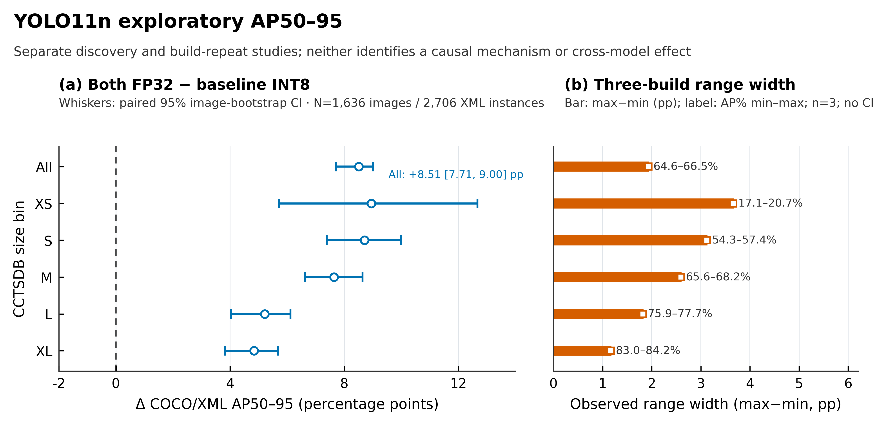

# Quantization Variability and Detection-Head Precision in TensorRT Traffic-Sign Detectors

**Working manuscript — claim-audited evidence-integrated draft v2**
Status: cross-model confirmation pending; do not treat the following as a final
abstract or submission-ready claim.

## Abstract

Post-training INT8 quantization is used to reduce numerical precision for
deployment, but end-to-end efficiency depends on the platform and workload
[1, 2, 6]. Aggregate accuracy alone does not show whether a measured change is
stable across engine builds or concentrated in localization-sensitive
outputs. We study this measurement problem using frozen YOLO traffic-sign
detectors on CCTSDB2021.
In an exploratory YOLO11n experiment, three repeated Uniform-calibration
TensorRT builds showed an observed full-set COCO/XML AP50–95 range of 1.93
percentage points (pp), while the extra-small-sign AP50 range was 7.82 pp.
In a separate precision-head ablation, retaining both selected detection-head
branches at FP32 rather than the baseline INT8 configuration was associated
with a +8.51 pp difference in full-set COCO/XML AP50–95 (paired image-bootstrap
95% percentile interval: +7.71 to +9.00 pp; one fixed dev split and one
calibration selection). A bounded YOLO11n end-to-end timing study recorded
arm-level means from 3.53 to 3.66 ms per image under its shared-GPU protocol.
These results are conditional observations, not estimates of independent
calibration or device variation and not a causal decomposition of box and
classification error. A locked confirmation on frozen YOLOv8n and YOLO26n is
approved but has not yet produced an audited artifact. Consequently, whether
the YOLO11n observation transfers across architectures remains unresolved.

**Keywords:** post-training quantization; object detection; traffic signs;
TensorRT; build variability; detection head; paired bootstrap.

## 1. Introduction

Post-training quantization is commonly evaluated against a floating-point
reference, while detector-specific methods also treat regression branches and
reliability under data variation as important design questions [2, 3]. A
single INT8 engine comparison can conflate
the quantization policy with calibration sample, compiler behavior, tactic
selection, export path and the task evaluator. A single mAP value therefore
does not identify the source of a change, and a single successful engine does
not characterize build-to-build variation. These distinctions matter when
objects are small: a modest coordinate or ranking perturbation can alter
IoU-based matching at stricter thresholds even when aggregate detection counts
look similar [5].

This paper focuses on what the present evidence can support about TensorRT
precision choices for frozen YOLO traffic-sign detectors. The initial
YOLO11n work contains a repeated-build observation, a precision-head
ablation, a paired image-bootstrap analysis, an end-to-end timing diagnostic,
and CPU application-level source/ONNX checks for two newer architectures.
Each channel answers a different question and is kept separate. We do not
propose a new PTQ algorithm. Instead, the empirical question is whether an
observed task-metric change survives measurement scrutiny and then appears in
other frozen architectures under a locked design.

We ask:

1. How large is the observed build-to-build variation for one fixed YOLO11n
   checkpoint and one calibration selection, including for small signs?
2. How do selected detection-head FP32 constraints relate to INT8 task AP on
   that fixed checkpoint, relative to one FP16 reference?
3. Does this precision-head pattern reproduce in frozen YOLOv8n and YOLO26n
   under multiple fixed train-only calibration selections and repeated builds?

The first two questions have exploratory results; the third is the purpose of
the operator-pending confirmation and has no result yet. Our contribution is
therefore a bounded measurement and analysis record, not a claim of universal
head sensitivity, quantization robustness, or deployment superiority.

## 2. Related work

Prior detector PTQ studies have considered regression-sensitive branches,
calibration under input degradations, reliability and adverse-case behavior,
task-aware calibration, and embedded deployment measurement [1–6]. In
particular, Reg-PTQ establishes regression-specialized detector quantization
as an existing method direction; localization sensitivity alone is not a new
algorithmic contribution [2]. Degradation-aware YOLO calibration studies
multiple model scales and synthetic input degradations, while reporting that
its calibration change did not improve robustness consistently across most
tested conditions [1]. Reliability work explicitly evaluates calibration
distribution and adverse-case behavior [3]. InlierQ instead uses
gradient-aware volume saliency to distinguish informative inliers from
anomalies [4]. TIDE motivates prediction-level error analysis [5], and
AgriJetsonBench demonstrates why deployment timing boundaries, precision,
power measurement and sustained-run validity should be explicit [6].

Our current completed evidence is a fixed-checkpoint YOLO11n measurement of
head-precision constraints alongside observed engine variation, with evaluator
identity and sampling unit made explicit. A prespecified two-model
confirmation is pending; no cross-architecture finding is yet supported.
Further related-work detail and primary-source verification status are in
[`related_work.md`](related_work.md).

## 3. Methods

### 3.1 Dataset, checkpoints and scope

The evidence uses the CCTSDB2021 benchmark [7] in the project’s train/dev
organization and the three detection classes in the accepted checkpoint/data
contract. The development evaluation
contains 1,636 images and 2,706 XML instances. YOLO11n is the exploratory
checkpoint; YOLOv8n and YOLO26n are frozen confirmation checkpoints. No
checkpoint was retrained or replaced for these studies. Input resolution was
640 × 640 and inference/capture used batch size one where the source protocol
records it. No official-test, negative-stress or weather evaluation is
included in the results below.

### 3.2 Evaluators and precision conditions

We preserve two metric channels. The first is the recorded Ultralytics
validation output. The second is a versioned COCO evaluator [8] over original
CCTSDB XML boxes and original-coordinate predictions (`pycocotools` 2.0.10),
including AP50, AP50–95 and the registered CCTSDB size bins. COCO/XML and
Ultralytics values are not interchangeable. Confidence intervals in the
paired analysis apply to COCO/XML contrasts only; Ultralytics values are
persisted point estimates.

The YOLO11n exploratory ablation compares one FP16 reference with four
TensorRT conditions: baseline INT8, selected box-branch operations constrained
to FP32, selected classification-branch operations constrained to FP32, and
both selected branches constrained to FP32. These are compiler precision
constraints for mapped active layers, not a new PTQ method and not a statement
that every operation in the head or every engine layer executes at that
precision. The ablation used one fixed Uniform calibration selection and the
recorded build/timing-cache protocol. Shared-cache coverage is not established
as a tactic lock.

### 3.3 Repeated-build and paired uncertainty analyses

The Uniform build study contains three builds for one checkpoint and one
calibration selection. We report descriptive mean, ddof=1 sample SD and
observed range; these builds are not three independent calibration samples.
The paired discovery analysis resamples the same image indices across
conditions, recomputes COCO/XML AP for each draw, retains repeated sampled
images, and uses 1,000 PCG64 draws with seed 20260916. Percentile intervals are
conditional on the frozen captures. They are not adjusted for multiple
contrasts and do not account for build, calibration-selection, training or
device variation.

### 3.4 Timing, application bridge and prospective confirmation

The YOLO11n timing sessions measure synchronous batch-one prediction wall
time from decoded CPU image through preprocessing, host-to-device transfer,
inference, postprocessing and NMS. Disk decode, model loading and warmup are
excluded. The session is not pure kernel time, and the shared RTX 8000 snapshots
do not prove isolation. We report pooled descriptive timing only.

For YOLOv8n and YOLO26n, the completed CPU bridge compared frozen native FP32
and accepted ONNX FP32 application metrics over the full dev set. It is a
separate export/application check, not TensorRT validation. Earlier strict
numeric/localization comparisons remain `FAIL` and are not overwritten by
similar application AP.

The approved confirmation uses three fixed Uniform selections (U42/U43/U44),
1,024 manifest-ordered train images per selection, four INT8 arms and three
repeats per model-selection-arm. Separately, it schedules three FP16 reference
builds per model, one in each round (six total); these FP16 repeats are not
one calibration-dependent control for every model-selection cell. The budget
is six auxiliary cache builders + 72 INT8 builds + six FP16 builds = 84
builder invocations, 78 dev captures and 127,608 dev image-model passes. No
retry, resume, replacement cell, canary, test-set capture or benchmark is
authorized. At this draft snapshot, fresh operator preflight is pending and
no v2 confirmation result is available.

## 4. Results

### 4.1 Repeated-build variation under one Uniform selection

Across three YOLO11n builds, full COCO/XML AP50 ranged by 0.68 pp and AP50–95
by 1.93 pp. The XS AP50 range was 7.82 pp, larger than the full-set range.
These are observed ranges, not uncertainty intervals or estimates of
calibration-selection variance.

**Table 1.** Three-build descriptive results for one frozen YOLO11n checkpoint
and one Uniform calibration selection. Build SD and min–max span builds; they
are not calibration-selection intervals.

| COCO/XML endpoint | Mean (%) | Build SD (pp) | Observed range (pp) |
|---|---:|---:|---:|
| Full AP50 | 95.115 | 0.383 | 0.677 |
| Full AP50–95 | 65.315 | 1.068 | 1.931 |
| XS AP50 | 57.609 | 3.910 | 7.820 |
| XS AP50–95 | 18.780 | 1.840 | 3.658 |
| S AP50 | 93.892 | 1.300 | 2.555 |
| S AP50–95 | 55.362 | 1.796 | 3.123 |

The source study also records different engine/inspector identities and
shared-lab sampled telemetry. The data establish that the three observed
builds were not byte-identical and that their task metrics varied; they do not
identify a single compiler tactic or prove that calibration sampling caused
the variation.

### 4.2 YOLO11n precision-head discovery

The captured COCO/XML full-set AP50–95 points were 66.543% for baseline INT8,
71.969% for bbox-FP32, 70.170% for classification-FP32, 75.050% for
both-FP32, and 75.655% for FP16. For the registered primary contrast,
both-FP32 minus baseline INT8 was +8.5067 pp (paired image-bootstrap 95%
percentile interval +7.7104 to +8.9999 pp). The corresponding Ultralytics
point difference was +9.663 pp; no interval is attached to that channel.

The both-FP32 point was 0.6049 pp below FP16 on COCO/XML AP50–95, with a
conditional paired interval from −0.9361 to −0.3670 pp. This is not a
non-inferiority test: no margin was registered for that purpose. The XS and S
AP50–95 contrasts were +8.9474 pp [5.7214, 12.6664] and +8.7087 pp [7.3844,
9.9855], respectively. These size-conditioned intervals share the same fixed
captures and bootstrap design.

Branch contrasts are not independent causal effects. Their sum need not equal
the both-branch contrast, and their observed interaction can depend on
compiler behavior and the single build per condition. These values motivate
the cross-model confirmation but do not establish transfer.

As summarized in Fig. 1, the conditional image-paired contrast sits beside the
separate three-build range without treating the two uncertainty summaries as
interchangeable. The positive discovery intervals support an association in
these captures, not a mechanism; the cross-model question remains pending.

**Figure 1.** Both-FP32 minus baseline-INT8 COCO/XML AP50–95 was positive in
the one-selection YOLO11n discovery across all six registered size strata;
the full-set contrast was +8.51 percentage points (pp; paired image-bootstrap
95% percentile interval +7.71 to +9.00 pp). Panel (a) shows conditional
intervals from 1,000 shared-image PCG64 draws (seed 20260916; 1,636 images,
2,706 XML instances) with one captured build per condition. Panel (b) shows
the observed max-minus-min span across three builds in a separate Uniform
repeat study (n=3), with labels giving the absolute AP endpoints; these spans
are descriptive, not confidence intervals.
Cross-model confirmation remains pending.

### 4.3 Timing and source/export bridges

The YOLO11n timing study completed 39 sessions (three rounds) with 200 warmup
and 1,000 measured calls per session. Pooled mean wall time ranged from 3.533
ms for baseline INT8 to 3.656 ms for both-FP32; FP16 was 3.592 ms. The observed
means are close in this one shared-server protocol. They do not establish a
stable speedup, latency equivalence, deployment SLA or energy trade-off.

In the CPU source/export bridge, each of YOLOv8n and YOLO26n completed 1,636
native CPU forwards and 1,636 ONNX CPU session calls. Under the same COCO/XML
application evaluator, AP50 deltas were 0.0 pp and AP50–95 deltas were
approximately +0.000009 pp for YOLOv8n and −0.000011 pp for YOLO26n
(ONNX−native). The strict numeric/localization verdicts remain failed; these
application metrics do not imply raw-output equivalence.

The TensorRT FP16 feasibility smoke completed two builds total (one per
model), 16 TensorRT application enqueues and 16 CPU ORT references, with no
native forward, warmup, calibration, dev capture or retry. This is evidence
that the bounded runner path executed; it is not an accuracy result.

### 4.4 Cross-model confirmation status

No YOLOv8n/YOLO26n precision-head INT8 confirmation result is reported. The
failed v1 attempt is preserved as a calibration-loader order failure and
contributes no scored conclusion. A2L-054 accepts one fresh v2 attempt subject
to current server/input/code/resource checks. Until the artifact is returned
and audited, the cross-model research question remains unanswered.

## 5. Discussion

Two design lessons emerge from the completed exploratory evidence. First,
point estimates should be paired with build-repeat observations, especially
when small-object metrics are a target. A full-set endpoint may look stable
while a size-conditioned endpoint exhibits a much wider observed range.
Second, a precision-head intervention can coincide with a sizable AP change
in one fixed YOLO11n experiment, but that result alone does not distinguish
precision arithmetic from calibration, compiler, cache, or build effects.
The pre-registered cross-model study is intended to test transfer while
separating calibration selections from repeated builds; it cannot retroactively
turn the discovery into a causal mechanism.

The near-equal source/ONNX task APs are useful evidence about one application
evaluator and accepted frozen exports. They coexist with strict raw numerical
FAILs because output-level error and task-level AP answer different questions.
Likewise, the successful FP16 smoke does not prove that all layers used FP16
or that FP16 is preferable. A deployment choice would require valid task AP,
timing and hardware evidence under the same declared boundary, none of which
is complete across the confirmation models yet.

## 6. Limitations

The main discovery uses one YOLO11n checkpoint, one calibration selection,
one development dataset and a shared lab GPU. Three builds are too few to
characterize a stable variance distribution; they do not sample independent
training runs or calibration policies. The paired image bootstrap treats
images as exchangeable and may understate dependence induced by camera,
scene or sequence. The intervals are exploratory, conditional and
unadjusted for multiple contrasts.

The COCO/XML custom-area evaluator is versioned and differs from the
Ultralytics validation channel. The paper must retain each label and avoid
cross-evaluator arithmetic. The head constraints cover mapped active
convolutions and must not be described as fully FP32 heads or uniform engine
precision. Timing is a synchronous end-to-end predict path on one shared
RTX 8000; sampled telemetry is not proof of isolation and no energy was
measured. No broad real-time deployment claim follows.

The cross-model confirmation has not completed. The earlier v1 run stopped
before a valid scored result; the v2 conditional authorization is not data.
The numeric/localization strict FAIL history remains unresolved and does not
currently demonstrate numerical equivalence. The evidence also covers only
CCTSDB2021 and fixed training seeds/checkpoints; generalization to other
datasets, cameras, classes, YOLO sizes, runtime versions or devices is unknown.
Finally, the present study does not propose or benchmark a new quantization
algorithm, does not measure energy, and makes no journal acceptance or quartile
guarantee.

## 7. Conclusion (provisional)

For one frozen YOLO11n/CCTSDB2021 setting, the recorded build-repeat and
precision-head observations justify a more controlled confirmation but do not
yet justify an architecture-independent precision-head claim. The cross-model
answer is pending the single approved v2 attempt and its full audit. Until then,
the correct conclusion is conditional and incomplete for transfer, not a
positive deployment recommendation.

## Reproducibility pointers

- Evidence ledger: [`evidence_ledger.md`](evidence_ledger.md)
- Related work: [`related_work.md`](related_work.md)
- Submission readiness: [`submission_readiness.md`](submission_readiness.md)
- Task board: [`task_board.md`](task_board.md)
- CSV extraction and source hashes: [`results/paper_core_v1/README.md`](../../results/paper_core_v1/README.md)
- Table generator: `scripts/export_paper_core_evidence.py`
- Claim/table/reference crosswalk: [`manuscript_audit_20261004.md`](manuscript_audit_20261004.md)

## References

1. T. Karimov, H. Imani, and A. Kazakov, “Quantization Robustness to Input
   Degradations for Object Detection,” arXiv:2508.19600, version 3, updated
   May 1, 2026. https://arxiv.org/abs/2508.19600v3
2. Y. Ding, W. Feng, C. Chen, J. Guo, and X. Liu, “Reg-PTQ:
   Regression-specialized Post-training Quantization for Fully Quantized
   Object Detector,” in *Proc. IEEE/CVF Conference on Computer Vision and
   Pattern Recognition (CVPR)*, 2024, pp. 16174–16184,
   doi:10.1109/CVPR52733.2024.01531.
3. Z. Yuan et al., “Benchmarking the Reliability of Post-training
   Quantization: a Particular Focus on Worst-case Performance,”
   arXiv:2303.13003, 2023. Venue/DOI not verified in this source check.
   https://arxiv.org/abs/2303.13003
4. M. Kim et al., “Inlier-Centric Post-Training Quantization for Object
   Detection Models,” arXiv:2602.03472, 2026. Publication status not verified.
   https://arxiv.org/abs/2602.03472
5. D. Bolya, S. Foley, J. Hays, and J. Hoffman, “TIDE: A General Toolbox for
   Identifying Object Detection Errors,” in *Computer Vision – ECCV 2020*,
   Lecture Notes in Computer Science, pp. 558–573, 2020,
   doi:10.1007/978-3-030-58580-8_33. DOI-registry metadata was checked; the
   Springer landing page remained behind a cookie redirect in this pass.
   https://arxiv.org/abs/2008.08115
6. H. Jahanifar et al., “AgriJetsonBench: External-Power-Referenced TensorRT
   Benchmarking of Agricultural Vision Models on Jetson Edge Platforms,”
   arXiv:2608.00927, 2026. Publication status not verified.
   https://arxiv.org/abs/2608.00927
7. J. Zhang et al., “CCTSDB 2021: A More Comprehensive Traffic Sign Detection
   Benchmark,” *Human-centric Computing and Information Sciences*, vol. 12,
   2022, doi:10.22967/HCIS.2022.12.023. Dataset record and release repository:
   https://centaur.reading.ac.uk/106129/ and
   https://github.com/csust7zhangjm/CCTSDB2021.
8. T.-Y. Lin et al., “Microsoft COCO: Common Objects in Context,” in
   *Computer Vision – ECCV 2014*, pp. 740–755, 2014,
   doi:10.1007/978-3-319-10602-1_48. This paper’s evaluator uses COCO matching
   with the project’s registered CCTSDB area-bin configuration.
